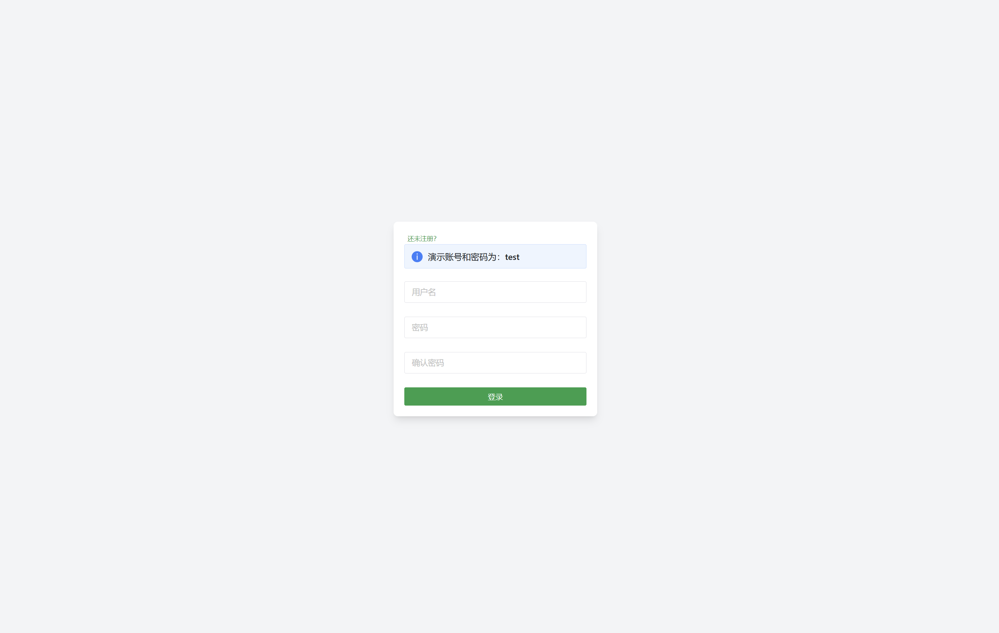
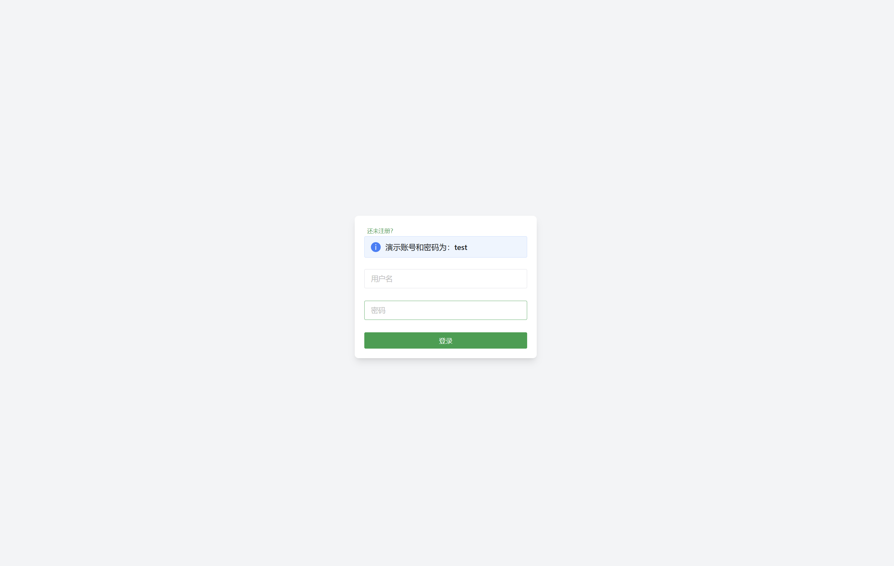
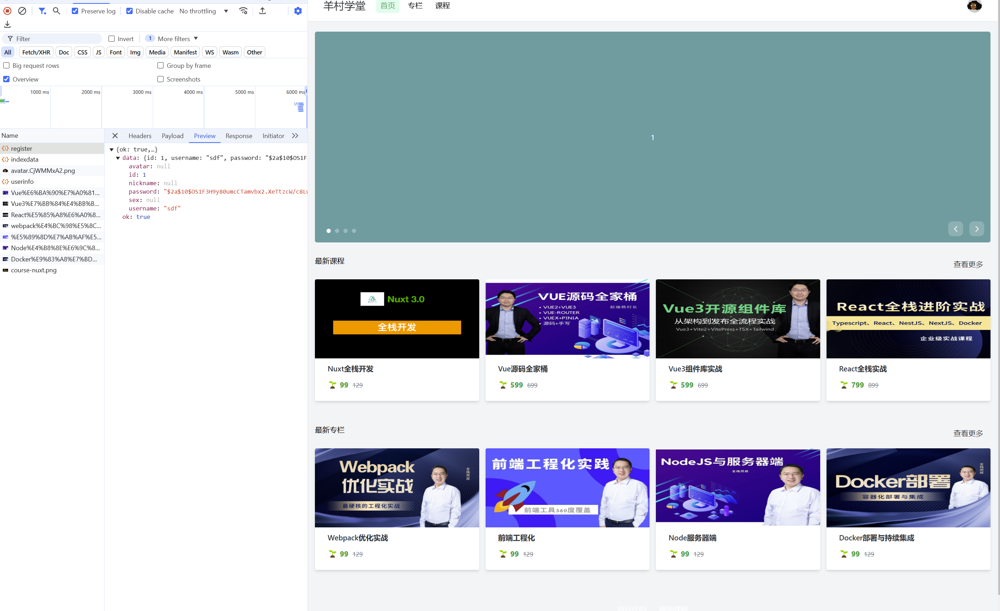
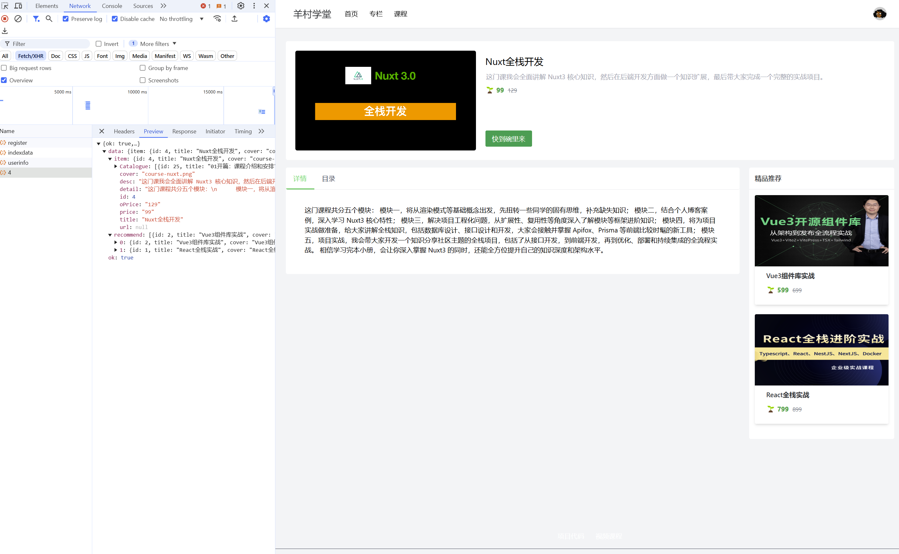
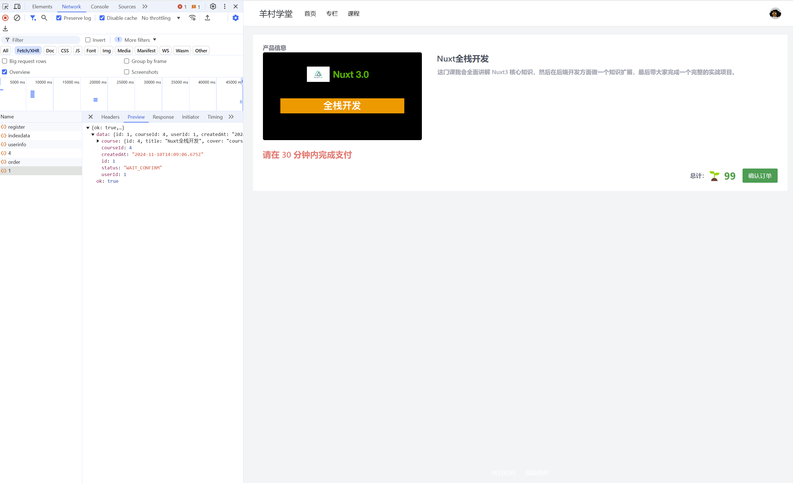
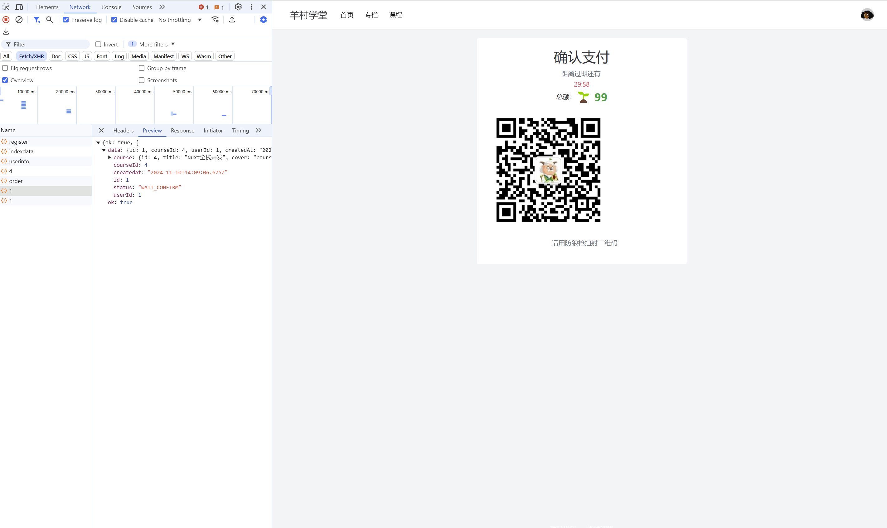
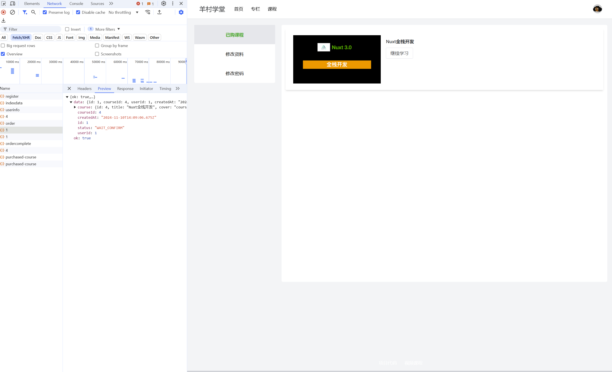
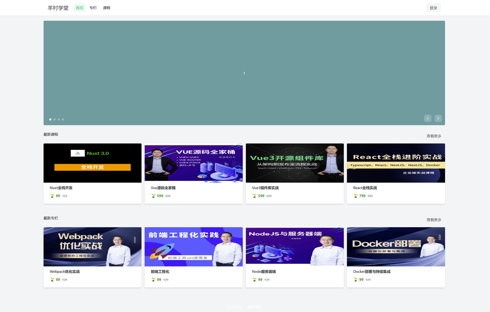

### 本地docker服务启动后截图























### 1.脚手架安装

```bassh
npx nuxi@latest init 项目名称
```

安装过程中有两个可选项:

* 选择包管理工具
* `Initialize git repository`


### 2.UI配置

#### 0.添加全局CSS样式

在`assets/css`目录下创建reactive.css文件, 然后在nuxt.config.js中添加css的配置项.

```js

//nuxt.config.js

export default defineNuxtConfig({
  devtools: {enable: true},
  modules: ['@nuxt/ui'],
  css: [
    'assets/css/reactive.css'  //添加全局响应式处理
  ]
})
```


#### 1.安装nuxtui

安装命令

```bash
npx nuxi@latest module add ui
```

配置项(以上的命令会自动配置)

```js
// nuxt.config.ts

export default defineNuxtConfig({
  modules: ['@nuxt/ui']
})
```

项目中使用了tailwindcss,但是ui框架中已经包含了tailwindcss库.


#### 2.全局安装naiveui

> https://juejin.cn/post/7387001928209825807
>
> [Nuxt.js - Naive UI](https://www.naiveui.com/en-US/os-theme/docs/nuxtjs)

**安装nuxtjs-naive-ui**

官网的安装命令有问题:

```bash
npx nuxi module add nuxtjs-naive-ui
```

一直报错: `  ERROR  [GET] "https://registry.npmjs.org/nuxtjs-naive-ui/latest": <no response> fetch failed`

背景信息:

* 命令行正确, 从官网copy来
* 网络正常
* 代理正常

原因并没有找到, 所以我们需要手动安装和配置:

1.安装

```bash
npm i nuxtjs-naive-ui
```

2.在nuxt.config.ts中添加配置

```js
export default defineNuxtConfig({
  compatibilityDate: '2024-04-03',
  devtools: { enabled: true },
  modules: ['nuxtjs-naive-ui']
})
```


**安装自动导入相关的包**

在终端上黏贴后直接运行:

```bash
npm i -D naive-ui
npm i unplugin-auto-import -D
npm i unplugin-vue-components -D
```

添加自动导入的配置:

```ts
//nuxt.config.ts

import AutoImport from 'unplugin-auto-import/vite'
import Components from 'unplugin-vue-components/vite'
import { NaiveUiResolver } from 'unplugin-vue-components/resolvers'

export default defineNuxtConfig({
  compatibilityDate: '2024-04-03',
  devtools: { enabled: true },
  modules: ['nuxtjs-naive-ui'],
  vite: {
    plugins: [
      AutoImport({
        imports: [
          {
            'naive-ui': [
              'useDialog',
              'useMessage',
              'useNotification',
              'useLoadingBar'
            ]
          }
        ]
      }),
      Components({
        resolvers: [NaiveUiResolver()]
      })
    ]
  }
})
```


在组件中测试是否成功引入:

```vue
<n-button>aaa</n-button>
```


### 3.登录/注册页面实现

#### 1.创建布局页面

##### layouts文件夹介绍

> [layouts/ · Nuxt Directory Structure](https://nuxt.com/docs/guide/directory-structure/layouts)

**是什么? **

> Nuxt提供了布局系统,可以把公用页面布局内容提取到`layouts`目录中以便复用.

**如何使用?**

在`app.vue`中直接使用`<NuxtLayout>`组件即可.

**其它功能**

* 默认Layout
* 命名Layout
  * 嵌套文件的命令方式
* 动态更改Layout `setPageLayout('custom')`
* 重写Layout内容

#### 1.创建默认布局

`layouts/default.vue`

需要在根目录下创建`components/`文件夹, 创建`MyHeader, MyFooter, Menu`组件, 在组件中可自动导入.

```vue
<template>
  <div class="min-w-[1024px] bg-gray-100 flex flex-col min-h-screen">
    <MyHeader />
    <main class="container container-content m-auto mt-20">
      <slot />
    </main>
    <MyFooter />
  </div>
</template>

<style>
  .container-content {
    
  }
</style>
```


app.vue中使用`defualt.vue`

```vue
<template>
	<NuxtLayout>
  	<NuxtPage></NuxtPage>
  </NuxtLayout>
</template>
```


#### 2.创建login/register等页面

##### 创建默认布局-登录布局

在`layouts`下创建`blank.vue`布局

```vue
<template>
  <div class="min-h-screen flex justify-center items-center bg-gray-100">
    <div class="shadow-lg bg-white rounded-lg p-5">
      <slot />
    </div>
  </div>
</template>

```


我们需要在login/register页面中使用`definePageMeta`中

##### definePageMeta

> [definePageMeta · Nuxt Utils](https://nuxt.com/docs/api/utils/define-page-meta)

为`pages/`路径下的页面组件设置元数据

为每个路由设置布局的静态或动态名称。如果需要禁用默认布局，则可以将其设置为 false。

```ts
definePageMeta({
  layout: 'blank' //为当前的页面组件设置blank样式的布局. blank位于'layouts/blank.vue'
})
```


#### 3.apifox提供测试接口

> 使用apiFox提供登录(login)和注册(register)的接口


#### 4.创建后端接口

##### 1.需要准备什么

后端接口需要操作数据库,我们需要docker来安装数据库和其管理端,需要prisma来对数据库进行CRUD操作

所以我们需要:

* 安装docker,进而安装MySql和Adminer管理端
* 安装prisma
* 编写后端接口


##### 2.安装docker

1.安装([官网下载](https://www.docker.com/))

2.根目录下添加`docker-compose.yml`文件

3.执行命令`docker compose up -d`,拉取镜像

4.安装成功, 可通过`http://localhost:8080`管理数据库

> 遇到的问题

使用命令行创建docker中的服务后, 数据库老师自动停止报错.在这里我们采用清理之前运行过的数据卷残留

```bash
docker-compose down -v
```


##### 3.安装prisma

0.prisma操作数据库应该在项目初始时就应该建立.

1.本地创建scheme文件: `server/database/scheme.prisma`

2.根目录下添加环境变量文件`.env`, 配置数据库地址

3.执行相关命令`npx prisma migrate dev --name init --scheme server/database/scheme.prisma`,生成数据库表结构

4.之后,便可以在后端接口中通过prismaclient访问数据库

5.如何访问, 我们在database下创建一个prisma.ts文件,用来暴露prisma实例. 通过实例上的方法来操作数据库

按照java开发中业务和逻辑分开的原则,在database文件夹下创建repositories文件夹,当作逻辑操作;业务操作复杂的可置于service文件夹下,简单的就直接置于database文件夹下.


访问流程说明:

前端发起请求 => `server/api/*`下的接口捕获 => `server/database/repositories`去操作后端数据库并返回数据


##### 4.注册后端接口

我们注册了:

`server/api/register.post.ts`接口

`server/api/login.ts`

`server/api/userInfo.get.ts`


##### 5.页面实现

登录页面和注册页面实现

在这里我们需要封装$fetch, 引入pinia管理全局状态,并编写接口.


**使用Pinia**

> 文档 [Nuxt.js | Pinia](https://pinia.vuejs.org/ssr/nuxt.html)

**安装**

此命令失败:   `npx nuxi@latest module add pinia`,提示Error说找不到仓库

直接安装 `npm i @pinia/nuxt pinia`

**添加配置文件**

添加nuxt的模块处理及配置自动导入功能.

```js
//nuxt.config.js

export default defineNuxtConfig({
  module: [
    '@nuxt/ui',
    [
      '@pinia/nuxt',
      //配置自动导入或直接使用和module同级pinia项
      {
        aotuImports: [
          'defineStore', //暴露量;以的store
          'storeToRefs'  //从store中提取单个引用
        ]
      }
    ]
  ]
})
```


**定义全局状态**

创建`store/user.ts`来定义全局状态

```ts
//store/user.ts

export const useUser = defineStore('user', {})
```


#### 首页前后端实现

#### 页面介绍

首页有4个部分组成: banner,内容推荐,最新课程,最新专栏


#### 种子数据

##### 如何使用prisma来创建种子数据?

1.在server/database文件夹下创建`seed.ts`或`seed.js`文件(类型取决于环境)

2.在package.json中配置seed命令

> 这个地方建议事件tsx包来替换ts-node, 因为:
>
> 1.不需要单独配置typescript.json中的'ts-node'的模块引入方式
>
> 2.package.json中的module形式可以继续使用`type: module `

```bash
npm i tsx
```


```json
"prisma": {
  // "seed": "ts-node server/database/seed.ts"
  "seed": "tsx server/database/seed.ts"
},
"scripts": {
  "seed": "npx prisma db seed",
  //...
}

```


3.创建种子数据

server/database/seed.ts

```ts
//....
```


4.使用cli命令,设定种子数据. 会向数据库中插入种子数据.

```bash
npx prisma db seed
```


##### 种子数据使用环境

* 开发环境中快速填充测试数据

* 设置数据库的初始状态

* 确保所有开发人员有相同的基础测试数据


#### 接口实现

##### 1.专栏接口和课程接口的数据请求

> server/repositories/columnRespository

```ts
import type {Column} from '@prisma/client'
import prisma from '~/server/database/client'

export async function getNewColumn(): Prisma<Column[] | null> {
  const result = await prisma.column.findMany({
    orderBy: {id: 'desc'},
    take: 4
  })
}
```


> server/repositories/courserRepository

```ts
import type { Course } from '@prisma/client'
import prisma from '~/server/database/client'

export async function getNewCourses(): Promise<Course[] | null> {
  const result = await prisma.course.findMany({
    orderBy: { id: 'desc' },
    take: 4,
  })
  return result
}

```


##### 2.专栏接口和课程接口的接口

```ts
import { getNewColumns } from '../database/repositories/columnRepository'
import { getNewCourses } from '../database/repositories/courseRepository'

export default defineEventHandler(async (e) => {
  try {
    const columns = await getNewColumns()
    const courses = await getNewCourses()

    return { ok: true, data: { columns, courses } }
  }
  catch (error) {
    return sendError(e, createError('获取数据失败'))
  }
})

```


#### 前端页面实现


### 列表页实现

#### 页面介绍

> 页面有3部分组成:
>
> * 面包屑导航
> * 内容列表
> * 分页器


#### 接口实现

我们需要实现两个接口：

- course：分页获取课程列表
  - Query params：page和size
  - 返回 { ok: boolean, data: { courses: Course[], total: number}}
- column：分页获取专栏列表
  - Query params：page和size
  - 返回 { ok: boolean, data: { columns: Column[], total: number}}

```ts
// server/database/columnRepository.ts 

export async function getColumns({page, size}): Promise<{columns: Column[] | null; total: number}> {
  const [columns, total] = await Promise.all([
    prisma.column.findMany({
      orderBy: {id: 'desc'},
      skip: page * size,
      take: size
    }),
    prisma.column.count()
  ])
  
  return { column, total }
}
```


```ts

// server/database/courseRepository.ts

export async function getCourses({ page, size }): Promise<{ courses: Course[] | null; total: number }> {
  const [courses, total] = await Promise.all([
    prisma.course.findMany({
      orderBy: { id: 'desc' },
      skip: page * size,
      take: size,
    }),
    prisma.course.count(),
  ])
  return { courses, total }
}

```


分别实现course和column接口, 

```ts
// server/api/course.ts

import { getCourses } from '../database/repositories/courseRepository'

export default defineEventHandler(async (e) => {
  try {
    // 获取分页信息
    const query = getQuery(e)
    const page = query.page ? parseInt(query.page as string) : 0
    const size = query.size ? parseInt(query.size as string) : 8
    // 分页获取课程列表和总条数
    const { courses, total } = await getCourses({ page, size })

    return { ok: true, data: { list: courses, total } }
  }
  catch (error) {
    return sendError(e, createError('获取数据失败'))
  }
})

```


```ts
// server/api/column.ts

import { getColumns } from '../database/repositories/columnRepository'

export default defineEventHandler(async (e) => {
  try {
    // 获取分页信息
    const query = getQuery(e)
    const page = query.page ? parseInt(query.page as string) : 0
    const size = query.size ? parseInt(query.size as string) : 8
    // 分页获取课程列表和总条数
    const { columns, total } = await getColumns({ page, size })

    return { ok: true, data: { list: columns, total } }
  }
  catch (error) {
    return sendError(e, createError('获取数据失败'))
  }
})

```


#### 前端页面实现

课程页面和专栏页面相似,都是由3部分组成:

* 面包屑
* 列表
* 分页

所以,我们用一个列表页来实现,

* 过一个动态路由`/list/:type`区分；
* 删除之前 course.vue 和 column.vue；
* 修改 MyHeader.vue 中的导航链接地址；
* 修改 index.vue 中的“更多课程”和“更多专栏”链接地址。

**创建pages/list/[type].vue**

> 使用动态路由

```vue
// pages/list/[type].vue

<!-- 课程列表页 -->
<script setup lang="ts">
import type { IResult } from '~/types/IResult'

const route = useRoute()
const type = route.params.type as string
const title = type === 'course' ? '课程' : '专栏'
useHead({ title })

const url = type === 'course' ? '/api/course' : '/api/column'
const page = ref(1)
const size = ref(8)
const {
  data,
} = await useFetch<IResult>(() => `${url}?page=${page.value - 1}`, {
  watch: [page],
})

const onPageChange = (pageNum) => {
  page.value = pageNum
}
</script>

<template>
  <div>
    <NBreadcrumb class="mb-5">
      <NBreadcrumbItem>
        <nuxt-link to="/">
          首页
        </nuxt-link>
      </NBreadcrumbItem>
      <NBreadcrumbItem>
        {{ title }}
      </NBreadcrumbItem>
    </NBreadcrumb>
    <!-- 课程渲染 -->
    <NGrid :x-gap="20" :cols="4">
      <NGi v-for="item in data?.data.list" :key="item.id">
        <Prod :data="item" :type="type" />
      </NGi>
    </NGrid>
    <!-- 分页组件 -->
    <div class="flex justify-center items-center mt-5 mb-10">
      <NPagination
        size="large" :item-count="data?.data.total" :page="page" :page-size="size"
        :on-update:page="onPageChange"
      />
    </div>
  </div>
</template>

```


### 详情页实现

#### 页面介绍

课程页、专栏详的情页设计非常相似，因此统一处理。它们由 3 部分构成：

- 课程/专栏简介：不同点是专栏没有价格；
- 详情/目录：不同点是专栏没有目录；
- 推荐列表：暂时显示最新的两个。

#### 接口实现

我们需要实现两个接口：

- /course/[id]：获取指定课程详情
  - 返回 { ok: boolean, data: { item: Course, recommend: Course[] }}
- /column/[id]：分页获取专栏列表
  - 返回 { ok: boolean, data: { item: Column, recommend: Column[] }}

更新两个 repository，columnRepository.ts

```ts
// server/database/columnRepository.ts

export function getColumnById(id: number): Promise<Column | null> {
  const result = await prisma.column.findFirst({
  	where: {
  		id,
		}
	})
  return result
}
```


```ts
//server/database/courseRepository.ts

export function getColumnById(id: number): Promise<Course | null> {
  const result = await prisma.course.findFirst({
  	where: {
  		id,
		},
    include: { Catalogue: true }
	})
  return result
}
```


分别实现course和column接口, 

`server/api/course/[id].ts`

```ts

//server/api/[id].ts
import {getCourseById, getColumns} from '~/server/database/repositories/courseRepository'
export default defineEventHandler(async(e) => {
  
})
```

`server/api/column/[id].ts`

```ts
// server/api/column/[id].ts

import { getColumnById, getColumns } from '~/server/database/repositories/columnRepository'

export default defineEventHandler(async (e) => {
  const id = e.context.params?.id ? parseInt(e.context.params.id) : undefined
  if (!id)
    return sendError(e, createError({ statusCode: 400, statusMessage: '参数错误' }))
  try {
    const column = await getColumnById(id)
    if (!column)
      return sendError(e, createError({ statusCode: 404, statusMessage: '没有对应专栏' }))

    const { columns: recommend } = await getColumns({ page: 1, size: 2 })

    return { ok: true, data: { item: column, recommend } }
  }
  catch (error) {
    return sendError(e, createError({ statusCode: 500, statusMessage: '服务器错误' }))
  }
})

```


#### 前端页面实现


### 订阅流程实现

#### 页面介绍

支付流程:

1. 首先创建订单（状态为等待确认 WAIT_CONFIRM)；
2. 然后跳转订单确认页面；
3. 用户确认订单（状态变为等待支付 WAIT_PAY）；
4. 并跳转支付页面；
5. 用户扫码支付结束（订单状态变为已完成 COMPLETED)；
6. 页面发现订单完成跳转至课程详情页。


#### 页面设计

订单确认页 + 支付页


#### 接口实现

我们需要实现两个接口：

- /order：创建订单。
  - method: post
  - body：{ courseId: number }
  - 返回 { ok: boolean, data: { orderId: number } }
- /order/[id]：获取订单详情。
  - method：get
  - 返回 { ok: boolean, data: Order }
- /order: 更新订单状态。
  - method：patch
  - body: { id: number, status: string }
  - 返回 { ok: boolean }


创建`server/database/repositories/orderRepository`

```ts
import type { Order } from '@prisma/client'
import prisma from '~/server/database/client'

export async function createOrder(data: Order) {
  const user = await prisma.order.create({data})
  return user
}

export async function getOrderById(id: number) {
  const result = await prisma.order.findUnique({
    where: {
      id
    },
    include: {
      course: {
        select: {
          title: true,
          cover: true,
          price: true
        }
      }
    }
  })
  return result
}

export async function updateOrder(id:number, data: Partial<Order>) {
  const result = awiat prisma.order.update({
    where: {
      id
    },
    data
  })
  return result
}
```


### 用户体验优化

#### 响应式设计

天啊


#### 页面权限控制

有些页面需要在登录之后才能看到,例如:

* 用户中心页面
* 订单确认页面
* 支付页面
* ...


##### 通过路由中间件实现页面权限控制

> 在vue项目中,是通过路由守卫的方式达到页面权限管理,nuxt封装了vue-router,想要获取路由器实例可以通过 useRouter，然后再添加守卫。然而官方却不推荐这么做，详情参见：
>
> [nuxt.com/docs/api/co…](https://link.juejin.cn/?target=https%3A%2F%2Fnuxt.com%2Fdocs%2Fapi%2Fcomposables%2Fuse-router%23navigation-guards)
>
> 

1.创建Auth中间件

```ts
// ~/middleware/auth.ts

export default defineNuxtRouteMiddleware((to, from) => {
  const token = useCookie('token')
  const route = useRoute()

  // 未登录重定向到登录页
  if (!token.value) {
    if (process.client)
      message.error('请先登录')

    return navigateTo(`/login?from=${route.fullPath}`)
  }
})

```


2.注册中间件

在需要的页面注册 auth 中间件。例如,在用户中心页面注册中间件.

```vue
// pages/usercenter.vue

definePageMeta({
	middleware: ['auth']
})
```


#### 展示加载进度

加载进度的反馈方式有很多,例如:

- 进度条
- 菊花图
- 骨架屏

我们使用naive-ui的骨架屏组件完成一个加载进度的实现:

1.创建公共loading组件:

在不同页面使用的时候还需要根据内容做调整

```vue
// ~/components/Loading.vue

<script setup lang="ts">
const props = defineProps({
  pending: {
    type: Boolean,
    default: false,
  },
})

// 防止加载过快画面闪烁
const loading = ref(false)
watchEffect(() => {
  if (props.pending && !loading.value) {
    loading.value = true
  }
  else {
    setTimeout(() => {
      loading.value = false
    }, 200)
  }
})
</script>

<template>
  <div>
    <template v-if="loading">
      <slot name="loading">
        <NCard v-for="i in 4" :key="i" class="mb-5">
          <NSkeleton text style="width: 30%" />
          <NSkeleton text :repeat="2" />
          <NSkeleton text style="width: 45%" />
          <NSkeleton text style="width: 60%" />
        </NCard>
      </slot>
    </template>
    <template v-else>
      <slot />
    </template>
  </div>
</template>

```


### 本地测试部署

#### 部署命令

1.先清理现有容器和缓存

```bash
docker-compose down -v
```

2.构建

```bash
docker-compose build --no-cache
```

3.启动服务并查看日志

```bash
docker-compose up
```


#### 遇到的问题:

启动之后,控制台报错:

```bash
docker-compose up
time="2024-11-10T11:35:49+08:00" level=warning msg="C:\\PersonalData\\github\\Nuxt\\nuxt3-app-course2\\docker-compose.yml: the attribute `version` is obsolete, it will be ignored, please remove it to avoid potential confusion"        
[+] Running 3/0
 ✔ Container nuxt3-app-course2-adminer_container-1   Runni...                                                   0.0s 
 ✔ Container nuxt3-app-course2-mysql_db_container-1  Runn...                                                    0.0s 
 ✔ Container nuxt_app                                Running                                                    0.0s 
Attaching to adminer_container-1, mysql_db_container-1, nuxt_app
nuxt_app              | [nuxt] [request error] [unhandled] [500] Named export 'VLazyTeleport' not found. The requested module 'vueuc' is a CommonJS module, which may not support all module.exports as named exports.
nuxt_app              | CommonJS modules can always be imported via the default export, for example using:
nuxt_app              |
nuxt_app              | import pkg from 'vueuc';
nuxt_app              | const { VResizeObserver, VFocusTrap, VLazyTeleport } = pkg;
nuxt_app              |
nuxt_app              |
nuxt_app              | [nuxt] [request error] [unhandled] [500] Named export 'VLazyTeleport' not found. The requested module 'vueuc' is a CommonJS module, which may not support all module.exports as named exports.
nuxt_app              | CommonJS modules can always be imported via the default export, for example using:
nuxt_app              |
nuxt_app              | import pkg from 'vueuc';
nuxt_app              | const { VResizeObserver, VFocusTrap, VLazyTeleport } = pkg;
nuxt_app              |
nuxt_app              |
```


解决方案:

这个错误是因为 vueuc 模块的导入方式有问题。这是一个典型的 CommonJS 和 ES Module 混用导致的问题。让我们来修复它：

1. 首先，检查你的项目中是否有直接使用 `vueuc` 的导入。通常这个模块是被 naive-ui 或其他 UI 库依赖的。
2. 修改导入方式，有几种解决方案：

方案一：修改 nuxt.config.ts，添加 transpile 配置：

```
typescriptCopyexport default defineNuxtConfig({
  // ... 其他配置
  build: {
    transpile: [
      'vueuc',
      /naive-ui/ // 如果你使用了 naive-ui
    ]
  },
})
```

方案二：如果你直接使用了 vueuc，修改导入方式：

```
typescriptCopy// 修改前
import { VLazyTeleport } from 'vueuc'

// 修改后
import vueuc from 'vueuc'
const { VLazyTeleport } = vueuc
```

方案三：添加 vite 配置来处理这个模块：

```
typescriptCopy// nuxt.config.ts
export default defineNuxtConfig({
  // ... 其他配置
  vite: {
    optimizeDeps: {
      include: ['vueuc']
    },
    build: {
      commonjsOptions: {
        transformMixedEsModules: true
      }
    }
  }
})
```

方案四：如果你使用的是 naive-ui，可以尝试更新配置：

```
typescriptCopy// nuxt.config.ts
export default defineNuxtConfig({
  // ... 其他配置
  build: {
    transpile: process.env.NODE_ENV === 'production'
      ? [
          'naive-ui',
          'vueuc',
          '@css-render/vue3-ssr',
          '@juggle/resize-observer'
        ]
      : ['@juggle/resize-observer']
  },
  vite: {
    optimizeDeps: {
      include: process.env.NODE_ENV === 'development'
        ? ['naive-ui', 'vueuc', 'date-fns-tz/formatInTimeZone']
        : []
    }
  }
})
```

1. 更新 package.json 中的依赖版本，确保使用最新的兼容版本：

```
jsonCopy{
  "dependencies": {
    "vueuc": "^latest",
    "naive-ui": "^latest" // 如果使用了 naive-ui
  }
}
```


